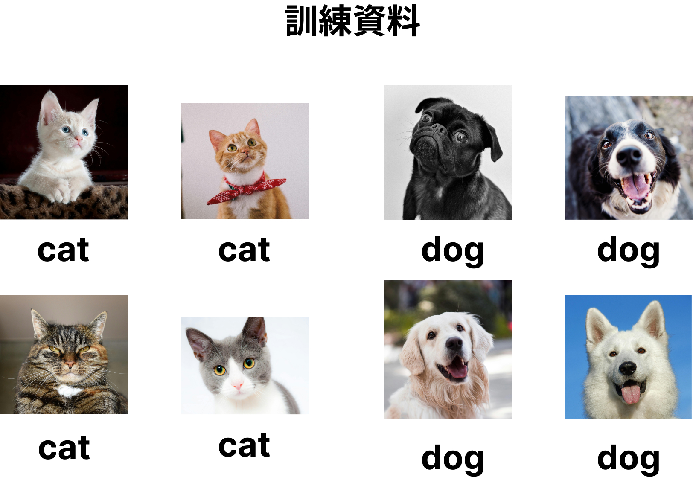
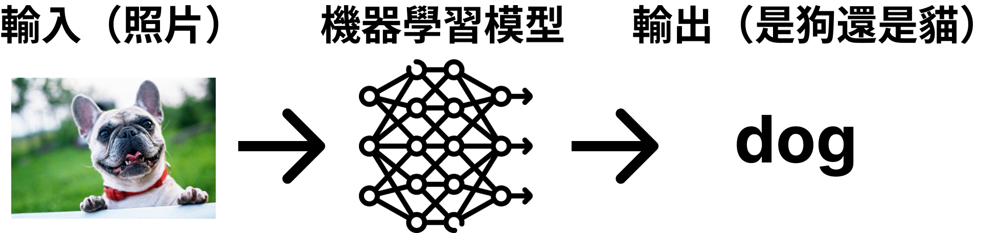
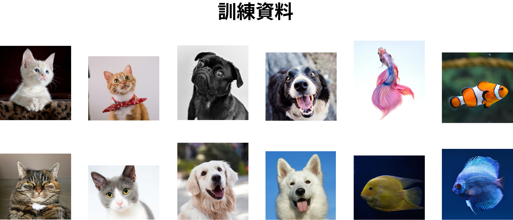
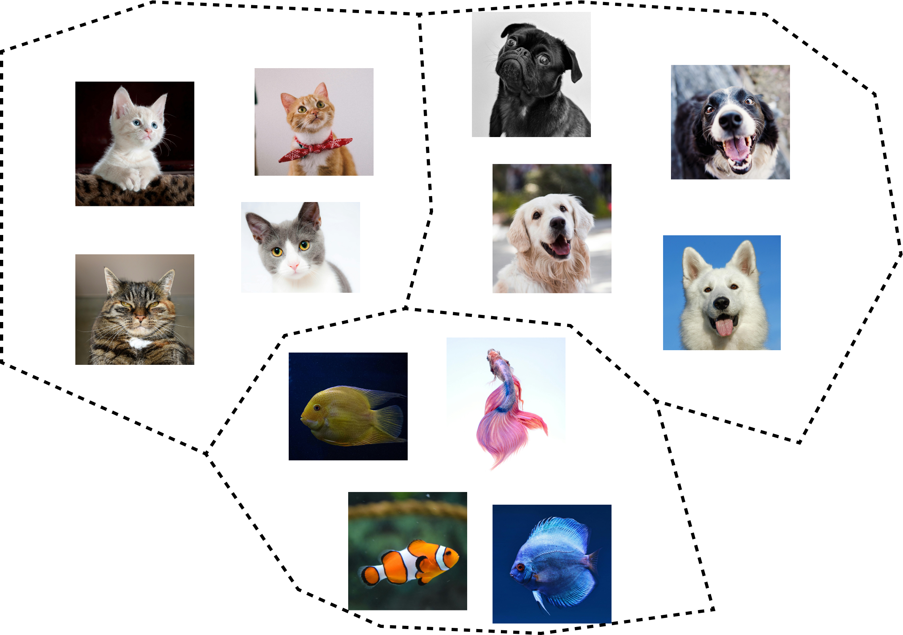

_Update: Feb 4, 2025_

在 AI 世界有太多太多名詞，對於小白來說特別容易感到沒有方向。不論是經典的機器學習或是深度學習，當提到訓練方法時，大致上可以分成三種：

1. **監督式學習 Supervised Learning**
2. **非監督式學習 Unsupervised Learning**
3. **半監督式學習 Semi-supervised Learning**

你可能會好奇：「為什麼叫監督式學習？難道我要在旁邊盯著模型學習嗎？」其實，「監督」的意思是指提供標註資料，而「非監督」則是讓模型自行尋找模式，今天這篇文章就會幫你釐清以上的問題。

# 監督式學習 Supervised Learning

> 監督式學習透過大量的 **標註資料（Labeled Data）** 訓練模型，讓模型學會從「已知答案」中找出規則，並應用到新的資料上。

舉例來說，現在你想要透過機器學習模型辨是貓或是狗，因此你收集了大量貓和狗的照片作為訓練資料，另外你還對照片加上註解，說明這張照片是貓還是狗，因此你的訓練資料即為「標註資料」。

只要有足夠的標註資料，經過訓練的模型就能正確的回答你這張照片是貓或是狗。在這個例子中，模型的輸入是圖片的像素數據，而輸出則是一個標籤（貓或狗）。透過大量標註過的圖片，模型學習如何將新的圖片對應到正確的分類。

**其他應用？**

監督式學習除了用來進行分類（如貓狗識別），還能用於:

- 房價預測 🏡 → AI 透過大量的「房屋特徵 + 成交價格」數據學習，能夠根據房屋的大小、地點和其他條件來預測新房屋的價格，幫助買賣雙方做出更好的決策。
- 病患康復時間預測 🏥 → AI 透過醫院收集的「病患狀況 + 康復時間」數據學習，當新病人來就診時，系統能夠根據病情預測大約需要多久才能康復，幫助醫生規劃治療方案。

**小結**

監督式學習就像是在「有老師指導」的情況下學習。模型學會從**已知的問題與答案**中找出規則，然後用這些規則來預測新資料的結果。

# 非監督式學習 Unsupervised Learning

> 非監督式學習使用 **未標記的資料** 來進行訓練，目標是讓模型自己找出數據中的規律，例如把相似的東西分成不同的類別。

同樣以動物來舉例，現在你有許多動物的照片如下圖

並且你希望找出這些動物可以分成幾類，於是將所有照片交給機器學習模型進行訓練。最後，模型告訴你可以分成貓、狗和魚三類，這就是一個非監督式學習經典的分群應用。

**其他應用？**

除了分群問題，非監督式學習還常見於：

- 音樂與電影推薦 🎵🎬 → Spotify 或 Netflix 會分析你的喜好，找出跟你相似的人，然後推薦你可能喜歡的歌曲或電影。
- 垃圾郵件過濾 📧 → 電郵服務會分析郵件內容，判斷哪些郵件「看起來像垃圾信」，即使沒有標記，它也能學會分類。
- 社群媒體標籤 📷 → Instagram 可能會自動將你的照片分組，例如「食物」、「風景」、「自拍」，幫助你更方便整理相冊。

**小結**

非監督式學習就像是「不認識新朋友，但試著找出他們的共同點」。它不需要事先標註的資料，而是透過分析數據，自己找出規則。

# 半監督式學習 Semi-supervised Learning

> 半監督式學習介於監督與非監督學習之間，它使用少量的標註資料與大量未標註的資料來訓練模型。

想像你擁有 10 萬張動物照片，但只有 5000 張是有標註的（貓或狗），這時你可以先用這些標註資料訓練一個基本模型，然後讓模型去學習未標註的資料，藉此提升分類準確率。這種方法在醫學影像分析（如腫瘤識別）與自然語言處理（如語音辨識）等領域特別有用，因為標註數據的取得成本通常很高。

# 總結

| 類型         | 標註資料              | 應用範圍                       |
| ------------ | --------------------- | ------------------------------ |
| 監督式學習   | 需要大量標註資料      | 影像分類、語音辨識、數值預測   |
| 非監督式學習 | 不需要標註資料        | 分群、降維、異常偵測           |
| 半監督式學習 | 少量標註 + 大量未標註 | 自然語言處理、大型影像數據分析 |

若你的數據有大量標註資訊，監督式學習是最佳選擇；若沒有標註數據，但希望從數據中找出模式，則適合使用非監督式學習；如果標註數據有限，但仍希望利用其提升模型效能，那麼半監督式學習是一種折衷方案。

# 參考資料

- [機器學習任務：監督學習/半監督學習/無監督學習](https://u9534056.medium.com/%E6%A9%9F%E5%99%A8%E5%AD%B8%E7%BF%92%E4%BB%BB%E5%8B%99-%E7%9B%A3%E7%9D%A3%E5%AD%B8%E7%BF%92-%E5%8D%8A%E7%9B%A3%E7%9D%A3%E5%AD%B8%E7%BF%92-%E7%84%A1%E7%9B%A3%E7%9D%A3%E5%AD%B8%E7%BF%92-9b75972f91d6)

- [監督式學習與非監督式學習之間有何差異？](https://aws.amazon.com/tw/compare/the-difference-between-machine-learning-supervised-and-unsupervised/)
