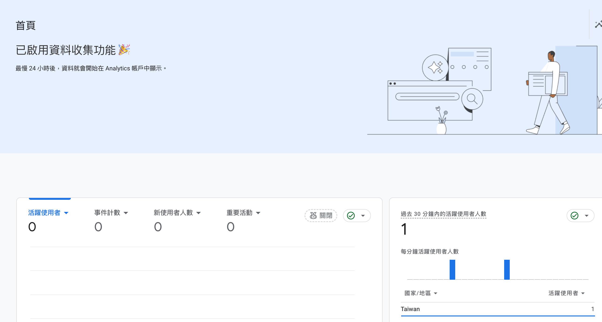

_Update: Feb 3, 2025_

在現在好像沒有自己的品牌是一件很稀有的事（ 比日本製的壓縮機還要稀少 ）。為了解決大家的煩惱，這是一篇帶你使用 **Hugo + Github Pages** 從零開始製作個人網站的教學！

那我們就直接開始！

# 1. 安裝 Hugo

本章節按照 [Hugo 官方推薦步驟](https://gohugo.io/installation/) 進行安裝。

- **MacOS**

  **Step 1.** <br>

  使用 Homebrew 進行安裝，若還未安裝 Homebrew 請先自行安裝。進入 Terminal (終端機) 輸入以下指令：

  ```bash
  brew install hugo
  ```

  **Step 2.** <br>

  輸入以下指令已檢查是否安裝成功：

  ```bash
  hugo --version
  ```

  若有出現版本資訊即代表安裝成功。

# 2. 套用主題

**Step 1.** <br>

到 [官方的主題網站](https://themes.gohugo.io/) 瀏覽並選擇自己喜歡的主題，本文以 _PaperMod_ 為例。

**Step 2.**<br>

先在本地創建一個新的 Hugo 網站。

```bash
hugo new site MyFreshWebsite --format yaml
# 將 MyFreshWebsite 替換為自己網站的名稱
```

- `--format yaml`：將 hugo 的設定檔更改為 yaml 格式。

**Step 3.** <br>

安裝 PaperMod 主題，這邊我按照最簡單的 [官方的 Method 1](https://adityatelange.github.io/hugo-PaperMod/posts/papermod/papermod-installation/)（git clone）:

- **安裝**

  在終端機中進入自己創建的網站 `MyFreshWebsite` 的資料夾中輸入：

  ```bash
  git clone https://github.com/adityatelange/hugo-PaperMod themes/PaperMod --depth=1
  ```

- **更新**

  在終端機中進入自己創建的網站 `MyFreshWebsite` 的資料夾中輸入：

  ```bash
  cd themes/PaperMod
  git pull
  ```

  <br>

**Step 4.** <br>

最後，在網站的設定檔 `config.yaml` 中將 Theme 指定為 PaperMod。

```yaml
theme: ["PaperMod"]
```

現在，只要在 Terminal 輸入下列指令，並開啟 terminal 給的網址，就可以看到預設的網站了。

```bash
hugo server -D
```

- `-D`：代表會顯示仍為 _草稿_ 的文章。

# 3. PaperMod Config 設定

當一打開網站，你會發現長的跟 PaperMod 官網顯示的完全不一樣，你可能會覺得被騙了，但其實只要花點時間設定就沒問題了！

關於 PaperMod 主題的設定，可以參考 [官方的 wiki](https://github.com/adityatelange/hugo-PaperMod/wiki/Variables)，所有 features 都是在 `config.yaml` 裡設定。

## Home page

如果要設定一般的 Home-Info Mode 網站主頁，範例設定如下：

```yaml {linenos=true}
params:
  homeInfoParams:
    Title: Hi there wave
    Content: Can be Info, links, about...

  socialIcons: # optional
    - name: "<platform>"
      url: "<link>"
    - name: "<platform 2>"
      url: "<link2>"
```

而如果想要將網站製作成 Portfolio ，也可以選擇更改為 Portfolio Mode

```yaml
params:
  profileMode:
    enabled: true
    title: "<Title>" # optional default will be site title
    subtitle: "This is subtitle"
    imageUrl: "<image link>" # optional
    imageTitle: "<title of image as alt>" # optional
    imageWidth: 120 # custom size
    imageHeight: 120 # custom size
    buttons:
      - name: Archive
        url: "/archive"
      - name: Github
        url: "https://github.com/"

  socialIcons: # optional
    - name: "<platform>"
      url: "<link>"
    - name: "<platform 2>"
      url: "<link2>"
```

## Navigation Bar

```yaml
menu:
  main:
  - identifier: about
      name: About
      url: /about/
      weight: 10
    - identifier: blogs
      name: Blogs
      url: /blogs/
      weight: 20
    - identifier: search
      name: Search
      url: /search/
      weight: 80
    - name: Tags
      url: tags/
      weight: 90
    - identifier: archives
      name: Archives
      url: /archives/
      weight: 99
```

| Variable   | Description                                      |
| ---------- | ------------------------------------------------ |
| identifier | 在 content 中資料夾或是需要的功能名稱            |
| name       | 在 navigation bar 所顯示的名稱                   |
| url        | 該分頁在網址列的代表名稱                         |
| weight     | 在 navigation bar 顯示的前後順序，數字越小越前面 |

## Archive Layout

在 content 資料夾建立一個 `archives.md` 檔案，並將下列內容加入：

```yaml
---
title: "Archive"
layout: "archives"
url: "/archives/"
summary: archives
---
```

## Comment

（待更新，敬請期待）

## 官方範例

[config.yml](https://github.com/adityatelange/hugo-PaperMod/blob/exampleSite/config.yml)

# 4. 建立和部署文章

## 建立

**方法一、**

在 terminal 使用

```bash
hugo new content content/<folder_name>/post.md
```

**方法二、**

比較簡單也比較好管理，直接在 content 中要建立文章的資料夾中，建立存放該文章的資料夾，並在該資料夾建立 `index.md`（有點饒口）

```shell
.
├── config.yml
├── content/
│   ├── archives.md
│   └── posts/
│       └── first_post/
│           └── index.md
├── static/
└── themes/
    └── PaperMod/
```

## 部署

當完成文章，可以使用

```base
hugo server -D
```

來檢查文章是否正確，若沒有問題，則可以使用

```bash
hugo -gc -minify
```

來部署文章，並將部署後的檔案 push 到 GitHub repository。

# 5. GitHub Pages 部署

**Step 1.**

建立一個 GitHub repository，repository 的名字可以隨意命名

**Step 2.**

將你的本地檔案 push 到剛剛創建的 GiuHub repository

**Step 3.**

進入你的 GitHub repository，選擇 **Settings** > **Pages**

在畫面中間的 **Build and Deployment** 段落可以看到 **Source**，我們將 **Source** 設定為 **GitHub Actions**

**Step 4.**

在本地 repository 新增一個檔案

```bash
touch .github/workflows/hugo.yaml
```

並將下列內容複製貼上到你新增的`.github/workflows/hugo.yaml`，依照你的需求，有可能需要更改 **branch name** 和 **hugo version**


```yaml
# Sample workflow for building and deploying a Hugo site to GitHub Pages
name: Deploy Hugo site to Pages

on:
  # Runs on pushes targeting the default branch
  push:
    branches:
      - main

  # Allows you to run this workflow manually from the Actions tab
  workflow_dispatch:

# Sets permissions of the GITHUB_TOKEN to allow deployment to GitHub Pages
permissions:
  contents: read
  pages: write
  id-token: write

# Allow only one concurrent deployment, skipping runs queued between the run in-progress and latest queued.
# However, do NOT cancel in-progress runs as we want to allow these production deployments to complete.
concurrency:
  group: "pages"
  cancel-in-progress: false

# Default to bash
defaults:
  run:
    shell: bash

jobs:
  # Build job
  build:
    runs-on: ubuntu-latest
    env:
      HUGO_VERSION: 0.137.1
    steps:
      - name: Install Hugo CLI
        run: |
          wget -O ${{ runner.temp }}/hugo.deb https://github.com/gohugoio/hugo/releases/download/v${HUGO_VERSION}/hugo_extended_${HUGO_VERSION}_linux-amd64.deb \
          && sudo dpkg -i ${{ runner.temp }}/hugo.deb
      - name: Install Dart Sass
        run: sudo snap install dart-sass
      - name: Checkout
        uses: actions/checkout@v4
        with:
          submodules: recursive
          fetch-depth: 0
      - name: Setup Pages
        id: pages
        uses: actions/configure-pages@v5
      - name: Install Node.js dependencies
        run: "[[ -f package-lock.json || -f npm-shrinkwrap.json ]] && npm ci || true"
      - name: Build with Hugo
        env:
          HUGO_CACHEDIR: ${{ runner.temp }}/hugo_cache
          HUGO_ENVIRONMENT: production
          TZ: America/Los_Angeles
        run: |
          hugo \
            --gc \
            --minify \
            --baseURL "${{ steps.pages.outputs.base_url }}/"
      - name: Upload artifact
        uses: actions/upload-pages-artifact@v3
        with:
          path: ./public

  # Deployment job
  deploy:
    environment:
      name: github-pages
      url: ${{ steps.deployment.outputs.page_url }}
    runs-on: ubuntu-latest
    needs: build
    steps:
      - name: Deploy to GitHub Pages
        id: deployment
        uses: actions/deploy-pages@v4
```



最後，將變更提交並推送到 GitHub。

**Step 5.**

回到 GitHub repository 的 main menu，選擇 **Actions** 就會看到剛剛提交的 commit 變成一個橘色的 workflow，代表我們的網站正在交給 GitHub Pages 部署。

等到變成綠色，代表網站部署成功！

# 6. 自訂域名

**Step 0.**

購買域名，可到例如 [namecheap](https://www.namecheap.com/)、[GoDaddy](https://tw.godaddy.com/) 等網站購買。

**Step 1.**

進入網站的 GitHub repository，點選 **Settings > Pages**。

並在 **Custom Domain** 中，設定購買的域名。接著，通常沒有在域名購買的網站上設定過，會顯示失敗。

**Step 2.**

到域名購買商的網站，幫你購買的域名設定 DNS， `A record` 以及 `CNAME`。

- A record

  host 或 record name 是 `@`

  ```
  185.199.108.153
  185.199.109.153
  185.199.110.153
  185.199.111.153
  ```

- CNAME

  host 或 record name 是 `www`。

  ```
  <your github account name>.github.io
  ```

當設定完成後，過一下 GitHub Pages 的自訂域名就設定完成了！

# 7. Google Analytics 追蹤網站流量

**Step 1.**
先到 https://analytics.google.com/ 照著步驟註冊帳號。
注意事項：

- 帳號名稱可以隨意填
- 屬性名稱可以填 Github 帳號

**Step 2.**
完成後，選擇網站。網站網址填入先前設定好的網址，串流名稱則為辨識用，可以隨意取。

**Step 3.**
取得 Google Analytics 提供的串流 ID。

在 `config.yaml` 中新增下列指令，並將 `G-XXXXXXXXXX` 替換為你的串流 ID

```yaml
googleAnalytics: G-XXXXXXXXXX
```

這樣 Hugo 會自動在 head.html 內插入 GA 代碼！

此外，params 內應該要有：

```yaml
params:
  env: production
```

這樣可以確保只會在 production 環境追蹤。

**Step 4.**

確保 head.html 內有 GA 代碼，Hugo 應該會在 themes/PaperMod/layouts/partials/head.html 內自動插入：

```html
{{- template "_internal/google_analytics.html" . }}
```

通常在最後幾行，如果這行已經存在，你不需要手動插入 GA 代碼，它應該會自動運行。

**Step 5.**
最後將其部署到 Github 即完成，範例如下：

```bash
hugo --gc --minify
git add .
git commit -m "Enable Google Analytics"
git push origin main
```

然後只要打開網站，並回到 Google Analytics 的網站，應該會出現以下畫面：


# 8. Google Search Console 讓大家可以搜尋到你

（待更新）

# 9. Other Tips

## Collapsible Section

[Discussion](https://stackoverflow.com/questions/71691219/add-collapsible-section-in-hugo)

創建 `/layouts/shortcodes/details.html`，並將下列加入其中：

```html
<details>
  <summary>{{ (.Get 0) | markdownify }}</summary>
  {{ .Inner | markdownify }}
</details>
```

接下來就可以在文章中使用 details ，如下：

```
{details title="Learn More" >} <----- 每個大括號外面都要再加一個大括號
Collapsed text
{</details >}
```

## Google Search Console 無法建立檢索頁面

當我想要為我的網頁建立檢索頁面時，發現 Google Search Console 提示錯誤：

> Google Search Console 提示「替代頁面（有適當的標準標記）」

並在下方可能問題顯示我的網頁提供 http 網址。

因此在與 ChatGPT 討論後，首先，我們先檢查 html 的 canonical URL。

我們發現 canonical URL 指向 `http`，而非我在 `config.yaml` 中設定的 `https`，因此導致 Google 認為 HTTP 版本才是主要頁面，而不索引 HTTPS 版本。

### 解決方法

1. 檢查 `config.yaml` 中的 `baseURL` 設定

   若為 `http`，則需要將 `http` 改為 `https`。

2. 修改 `head.html` 中的 canonical URL 設定

   在 blog 的 layout 新增 partial 資料夾，並在 partial 中新增 `head.html` 覆蓋 PaperMod 主題中的 `head.html`

   再來找到以下程式碼：

   ```html
   <link rel="canonical" href="{{ if .Params.canonicalURL -}} {{ trim
   .Params.canonicalURL " " }} {{- else -}} {{ .Permalink }} {{- end }}">
   ```

   將 `{{ .Permalink }}` 改為 `{{ .Permalink | absURL }}`

3. 重新部署

   重新部署網站，並回到 Google Search Console 查看，應該會發現已經可以建立檢索頁面了。

# 參考資料

- [Custom Doamin](https://docs.github.com/en/pages/configuring-a-custom-domain-for-your-github-pages-site/managing-a-custom-domain-for-your-github-pages-site)
- [Hugo on GitHub Pages](https://gohugo.io/hosting-and-deployment/hosting-on-github/)
- [PaperMod](https://adityatelange.github.io/hugo-PaperMod/)
- [How to build a portfolio website for data science | Hugo + Hostinger](https://www.youtube.com/watch?v=sm3IuE7zkYQ&list=PLeiDFxcsdhUrzkK5Jg9IZyiTsIMvXxKZP&index=2&t=2855s)
- [Hugo+PaperMod 双语博客搭建 Home-Info+Profile Mode](https://www.yunyitang.me/hugo-papermod-blog/)
- [[Hugo 自架站-5]安裝 Google Analytics 追蹤網頁的流量與成效](https://deanlin.net/blog/202501/hugo5-install-google-analytics-to-track-website-traffic/)
