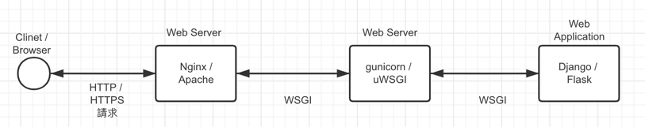

## WSGI 介紹

**WSGI (Python Web Server Gateway Interface)** 是一種 **協議 protocol**，定義了 web server 和 python web application 或 framework 之間溝通的規範。

它的目的是讓**不同的 Python Web Framework (如 Flask、Django)** 與**不同的 Web Server (如 Gunicorn、uWSGI)** 可以互相兼容。

所以，**WSGI web server** 其實就是應用了 WSGI 的 Web server。

📌 **運作方式：**

1. Client 發送 HTTP request（Web browser → Web server）。
2. Web server (e.g. gunicorn) 透過 WSGI 呼叫 Python applicatoin（e.g. Flask/Django）。
3. Python applicatoin 處理請求，並回傳 HTTP response。
4. Web server 再將 response 傳回給 web browser。

## Gunicorn 介紹

Gunicorn (Green Unicorn) 是一種**基於 unix 系統 的 WSGI HTTP server**，專門用來**執行 Python Web 應用程式 (如 Flask、Django)** ，並提供**高效能的並發處理**。通常在 **反向代理 (Nginx, Apache)** 與 **Web 應用程式** 之間。



**📌 為什麼要使用 Gunicorn?**

Python 內建的 `app.run()` 只能執行 single thread 的任務，但 Gunicorn 可以同時開啟多個 worker，處理多個請求：

```shell
gunicorn -w 4 -b 0.0.0.0:8080 app:app
```

- -w 4 代表啟動 4 個 worker，讓應用程式可以同時處理 4 個請求。

**📌 Gunicorn 特色**

1. 簡單易上手
2. 輕量級
3. 支援所有 **WSGI application (Django, Flask 等等)**
4. 如上所說，支援多 worker，提升效能

以上就是 WSGI 和 Gunicorn 的介紹，希望大家都收穫滿滿～

# Reference

- [一文详解 gunicorn 的功能及使用方法](https://blog.csdn.net/xu710263124/article/details/118975404)
- [【Flask 教學系列】Flask 為甚麼需要 WSGI 與 Nginx](https://www.maxlist.xyz/2020/05/06/flask-wsgi-nginx/)
